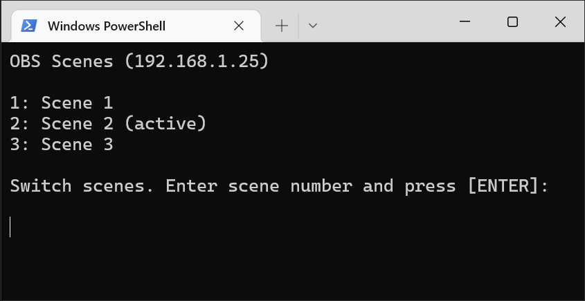
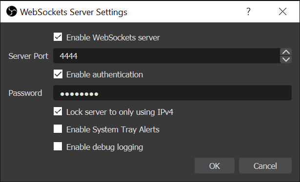

# obs-cli-scene-remote

Basic TUI (Text User Interface) for switching scenes in OBS.



## Setup

1. Install [obs-cli](https://github.com/muesli/obs-cli) on the client computer. Make sure `obs-cli` is added to path. 
2. On the computer running the OBS instance you're trying to control, install [obs-websockets](https://github.com/Palakis/obs-websocket). Set a password and enabled the following settings.


## Config

Edit `config.json` with the host, password and port of the OBS instance you want to control. For example:

```json
{
    "host": "192.168.1.25",
    "password": "password",
    "port": 4444
}
```

## Usage

Start OBS on target computer. Run `main.py`. Enter scene number and press `[ENTER]` to change scenes. Have fun!
